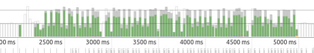
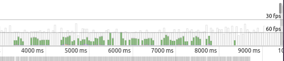

# Result of Udacity P4 Website Performance Optimization portfolio project

Project consists of two parts

- Website Performance Optimization
- Browser Rendering Optimization


## Summary 

###Part 1: Optimize PageSpeed Insights score for index.html

* Optimized files are under the directory `dist/` checked-in.
* Optimization is automated using the gulp build system and based on the original files.
* Optimized files achieve 100% for Google Page Insights when using own web server.
* The Undertow web server was used for the tests with compression and caching configured.

To run Google Page Speed Insights with optimized pages and the Undertow web server, click on the links.
(PSI should report 100 / 100)

* [PSI http://www.kuepfer.sh:8778/index.html](https://developers.google.com/speed/pagespeed/insights/?url=http://www.kuepfer.sh:8778/)
* [PSI http://www.kuepfer.sh:8778/project-2048.html](https://developers.google.com/speed/pagespeed/insights/?url=http://www.kuepfer.sh:8778/project-2048.html)
* [PSI http://www.kuepfer.sh:8778/project-webperf.html](https://developers.google.com/speed/pagespeed/insights/?url=http://www.kuepfer.sh:8778/project-webperf.html)
* [PSI http://www.kuepfer.sh:8778/project-mobile.html](https://developers.google.com/speed/pagespeed/insights/?url=http://www.kuepfer.sh:8778/project-mobile.html)

###Part 2: Optimize Frames per Second in pizza.html

* Updated files are checked in at original location under the directory `views/`
* Optimized and minified files are accessable under [Cam's Pizzeria](http://www.kuepfer.sh:8778/views/pizza.html)

## Part 1: Optimize PageSpeed Insights score for index.html

I am using the [gulp](http://gulpjs.com/) build system to automate the optimization of the web pages.
gulp is a streaming build system, based on nodejs, built by [Fractal](https://github.com/wearefractal) and the open source community.
There are several nodejs gulp plugins supporting the HTML page optimization:

* [gulp-imagemin](https://www.npmjs.com/package/gulp-imagemin) - Minify PNG, JPEG, GIF and SVG images.
* [imagemin-pngquant](https://www.npmjs.com/package/imagemin-pngquant) - Used by gulp-imagemin plugin.
* [gulp-uglify](https://www.npmjs.com/package/gulp-uglify) - Minify files with UglifyJS
* [gulp-minify-css](https://www.npmjs.com/package/gulp-minify-css) - Minify css with clean-css.
* [gulp-htmlmin](https://www.npmjs.com/package/gulp-htmlmin) - Plugin to minify HTML.
* [critical](https://github.com/addyosmani/critical) - Extract & Inline Critical-path CSS from HTML (1)
* [psi](https://www.npmjs.com/package/psi) - Page Speed Insights with reporting.

(1) The 'critical.stream' function of the critical plugin is only supported by the plugin on github but not yet by the plugin on npmjs. 


### Page optimization

The development loop for page optimization has four steps, prior of this the web-server must be started.

1. Add (or update) optimization tasks to the build file `gulpfile.js`
1. Run the command `gulp` to generate the optimized HTML-, JavaScript- and CSS-files.
1. Click on the test link or run `gulp psi:mobile` to retrieve page score.
1. Continue with step 1.


### Installation 

Assuming nodjs is installed on the system run the shell commands

```bash
npm install --global gulp
npm install --save-dev gulp-imagemin
#  .. continue for all required plugins
```

See gulp [getting-started](https://github.com/gulpjs/gulp/blob/master/docs/getting-started.md) for further details.

Install Addy Osmani's latest critical plugin from github.


```bash
npm install -S "git+https://github.com/addyosmani/critical.git"
```


### Configration

The build file `gulpfile.js` is a JavaScript file with the task of the gulp build. The tasks for this project are:

Tasks to clean

* **clean:dist** - Deletes all files generated in the `dist` directory tree.
* **clean:download** - Removes files downloaded by the download:font and download:analytics tasks. These files will be processed by 
the minify-css and minify:js tasks and are stored after processing under `dist/css` and `dist/js`.

Tasks to download files

* **download:font** - Download Google font file. To support embeding by the 'critical' plugin, the file must be stored on the local disk.
* **download:analytics** - Download Google analytics.js file. For 100% page insight file has to be served through own web server 
with at least one week cache life time.

Tasks to minify or compress files

* **minify:image** - Optimize / compress images.
* **minify:js** - Minify JavaScript files.
* **minify-css** -Minify CSS files.

Task to process HTML files

* **critical** - Process HTML files.
  * Replace remote HTTP URLs with references to local downloaded files (to be able to set HTTP header directives for caching)
  * Minify HTML.
  * Generate and inline critical-path CSS. 

Task to run Google Page Speed Insights from gulp

* **psi:mobile** - Run Google Page Speed Insights for mobile page score.
* **psi:desktop** - Run Google Page Speed Insights for desktop page score.

Summary tasks

* **build** - Single task to execute all of the tasks above at once
* **default** - Task executed when gulp is called without a task argument


### Setting up and run Undertow web server

To gain 100% by Google Page Speed, beside adjusting the source files, setting up a web server with certain aspects is needed.
For this project I am utilizing the [Undertow](http://undertow.io/) web server. Undertow may be setup using a Java class.
The source for my example is under the directory `SimpleServer/`. The main and only class is `fileserving.StaticHttpServer`.
The server listens at port `8778`.

This serer has three configuration sections

* Serve static files
* Enabling compression
* Set HTTP header cache control fields to a value larger than one week

To run the server execute (a Java JDK 1.8 is required):

```
cd SimpleServer
gradle run
```


### Accessing the Development Server by Google Page Speed

To give Google Page Speed access to the pages served by Undertow on the local computer, the ADSL modem / router
utilized to access the internet hast to forward to the port of the web server.

* Configure ADSL router for port forwarding
* Determine own IP address through http://whatismyipaddress.com/<br>
  Returns in my case 188.60.34.5
* The URL for Google Page Speed is therefore http://188.60.34.5:8778/index.html


#### URLs to test

The URLs to access the pages of the project through page speed are:

* [index](https://developers.google.com/speed/pagespeed/insights/?hl=en&url=http://188.60.34.5:8778/index.html)
* [project-2048](https://developers.google.com/speed/pagespeed/insights/?hl=en&url=http://188.60.34.5:8778/project-2048.html)
* [project-mobile](https://developers.google.com/speed/pagespeed/insights/?hl=en&url=http://188.60.34.5:8778/project-mobile.html)
* [project-webperf](https://developers.google.com/speed/pagespeed/insights/?hl=en&url=http://188.60.34.5:8778/project-webperf.html)
* [pizza](https://developers.google.com/speed/pagespeed/insights/?hl=en&url=http://188.60.34.5:8778/views/pizza.html)


 
## Browser Rendering Optimization
 
### Changes in main.js

Optimized the function `changePizzaSizes()` according to the video.

```JavaScript
  function changePizzaSizes(size) {
    switch(size) {
      case "1":
        newwidth = 25;
        break;
      case "2":
        newwidth = 33.33;
        break;
      case "3":
        newwidth = 50;
        break;
      default:
        console.log("bug in sizeSwitcher");
    }
    var randomPizzas = document.querySelectorAll(".randomPizzaContainer");
    for (var i = 0; i < randomPizzas.length; i++) {
      randomPizzas[i].style.width = newwidth + "%";                                 // layout invalidation
    }
  }
```

In the for loop where the pizzas are created, moved statement document.getElementById("randomPizzas") out of the loop.
This avoids 96 unneeded calls of `document.getElementById("randomPizzas")`.

```JavaScript
var pizzasDiv = document.getElementById("randomPizzas");
for (var i = 2; i < 100; i++) {
  pizzasDiv.appendChild(pizzaElementGenerator(i));
}
```
 
Avoid forced synchronous layout by moving access of scrollTop property access out of the for loop.

```JavaScript
  var scrollTop = document.body.scrollTop;
  var items = document.querySelectorAll('.mover');
  for (var i = 0; i < items.length; i++) {
    var phase = Math.sin((scrollTop / 1250) + (i % 5));
    items[i].style.left = items[i].basicLeft + 100 * phase + 'px';
  }
``` 
 
 
Run requestAnimationFrame with updatePositions on scroll to allows the browser to run
the  event handler when it is free to do new paint work on the screen.
This is not a big performance boost compared to `window.addEventListener('scroll', updatePositions);`

```JavaScript
 window.addEventListener('scroll', function() {
   window.requestAnimationFrame(updatePositions);
 });
``` 

Reduced the for loop in `document.addEventListener`.
On a full hd screen 32 pizzas are enough to display 4 rows and 8 columns with pizzas.

```JavaScript
   for (var i = 0; i < 32; i++) {
       ...
   }
```


Time line after applying the optimizations until here.



 
 
### Changes in style.css

To declare ahead-of-time what properties are likely to change in the future, added `will-change: left` to the class mover.
This is a CSS to hint to the browser about using a new composite layer.

```CSS
 .mover {
   position: fixed;
   width: 256px;
   z-index: -1;
   will-change: left;
 }
``` 

### Final timeline



The page update is mostly performed within 16ms.
Further investigation should be performed to reduce the 'Composite Layers' paint time.


 
## References

* [Developing a gulp Edge - The Streaming Build System](http://bleedingedgepress.com/developing-gulp-js-edge/)
* [Adi Osmani, Critical path plugin for nodejs](https://github.com/addyosmani/critical)
* [Demo of critical path plugin](https://github.com/addyosmani/critical-path-css-demo)
* [Udertow WebServer](http://undertow.io/)
* [Undertow Page Compression](http://stackoverflow.com/questions/28295752/compressing-undertow-server-responses)


# Original text from Udacity

## Website Performance Optimization portfolio project

Your challenge, if you wish to accept it (and we sure hope you will), is to optimize this online portfolio for speed! In particular, optimize the critical rendering path and make this page render as quickly as possible by applying the techniques you've picked up in the [Critical Rendering Path course](https://www.udacity.com/course/ud884).

To get started, check out the repository, inspect the code,

### Getting started

####Part 1: Optimize PageSpeed Insights score for index.html

Some useful tips to help you get started:

1. Check out the repository
1. To inspect the site on your phone, you can run a local server

  ```bash
  $> cd /path/to/your-project-folder
  $> python -m SimpleHTTPServer 8080
  ```

1. Open a browser and visit localhost:8080
1. Download and install [ngrok](https://ngrok.com/) to make your local server accessible remotely.

  ``` bash
  $> cd /path/to/your-project-folder
  $> ngrok 8080
  ```

1. Copy the public URL ngrok gives you and try running it through PageSpeed Insights! Optional: [More on integrating ngrok, Grunt and PageSpeed.](http://www.jamescryer.com/2014/06/12/grunt-pagespeed-and-ngrok-locally-testing/)

Profile, optimize, measure... and then lather, rinse, and repeat. Good luck!

####Part 2: Optimize Frames per Second in pizza.html

To optimize views/pizza.html, you will need to modify views/js/main.js until your frames per second rate is 60 fps or higher. You will find instructive comments in main.js. 

You might find the FPS Counter/HUD Display useful in Chrome developer tools described here: [Chrome Dev Tools tips-and-tricks](https://developer.chrome.com/devtools/docs/tips-and-tricks).

### Optimization Tips and Tricks
* [Optimizing Performance](https://developers.google.com/web/fundamentals/performance/ "web performance")
* [Analyzing the Critical Rendering Path](https://developers.google.com/web/fundamentals/performance/critical-rendering-path/analyzing-crp.html "analyzing crp")
* [Optimizing the Critical Rendering Path](https://developers.google.com/web/fundamentals/performance/critical-rendering-path/optimizing-critical-rendering-path.html "optimize the crp!")
* [Avoiding Rendering Blocking CSS](https://developers.google.com/web/fundamentals/performance/critical-rendering-path/render-blocking-css.html "render blocking css")
* [Optimizing JavaScript](https://developers.google.com/web/fundamentals/performance/critical-rendering-path/adding-interactivity-with-javascript.html "javascript")
* [Measuring with Navigation Timing](https://developers.google.com/web/fundamentals/performance/critical-rendering-path/measure-crp.html "nav timing api"). We didn't cover the Navigation Timing API in the first two lessons but it's an incredibly useful tool for automated page profiling. I highly recommend reading.
* <a href="https://developers.google.com/web/fundamentals/performance/optimizing-content-efficiency/eliminate-downloads.html">The fewer the downloads, the better</a>
* <a href="https://developers.google.com/web/fundamentals/performance/optimizing-content-efficiency/optimize-encoding-and-transfer.html">Reduce the size of text</a>
* <a href="https://developers.google.com/web/fundamentals/performance/optimizing-content-efficiency/image-optimization.html">Optimize images</a>
* <a href="https://developers.google.com/web/fundamentals/performance/optimizing-content-efficiency/http-caching.html">HTTP caching</a>

### Customization with Bootstrap
The portfolio was built on Twitter's <a href="http://getbootstrap.com/">Bootstrap</a> framework. All custom styles are in `dist/css/portfolio.css` in the portfolio repo.

* <a href="http://getbootstrap.com/css/">Bootstrap's CSS Classes</a>
* <a href="http://getbootstrap.com/components/">Bootstrap's Components</a>

### Sample Portfolios

Feeling uninspired by the portfolio? Here's a list of cool portfolios I found after a few minutes of Googling.

* <a href="http://www.reddit.com/r/webdev/comments/280qkr/would_anybody_like_to_post_their_portfolio_site/">A great discussion about portfolios on reddit</a>
* <a href="http://ianlunn.co.uk/">http://ianlunn.co.uk/</a>
* <a href="http://www.adhamdannaway.com/portfolio">http://www.adhamdannaway.com/portfolio</a>
* <a href="http://www.timboelaars.nl/">http://www.timboelaars.nl/</a>
* <a href="http://futoryan.prosite.com/">http://futoryan.prosite.com/</a>
* <a href="http://playonpixels.prosite.com/21591/projects">http://playonpixels.prosite.com/21591/projects</a>
* <a href="http://colintrenter.prosite.com/">http://colintrenter.prosite.com/</a>
* <a href="http://calebmorris.prosite.com/">http://calebmorris.prosite.com/</a>
* <a href="http://www.cullywright.com/">http://www.cullywright.com/</a>
* <a href="http://yourjustlucky.com/">http://yourjustlucky.com/</a>
* <a href="http://nicoledominguez.com/portfolio/">http://nicoledominguez.com/portfolio/</a>
* <a href="http://www.roxannecook.com/">http://www.roxannecook.com/</a>
* <a href="http://www.84colors.com/portfolio.html">http://www.84colors.com/portfolio.html</a>
